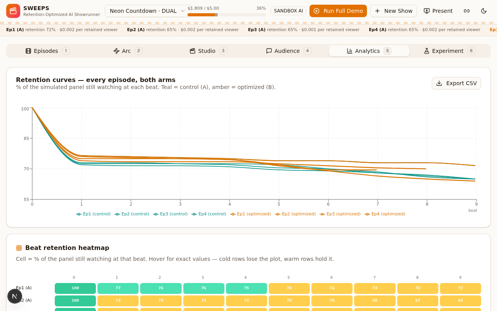
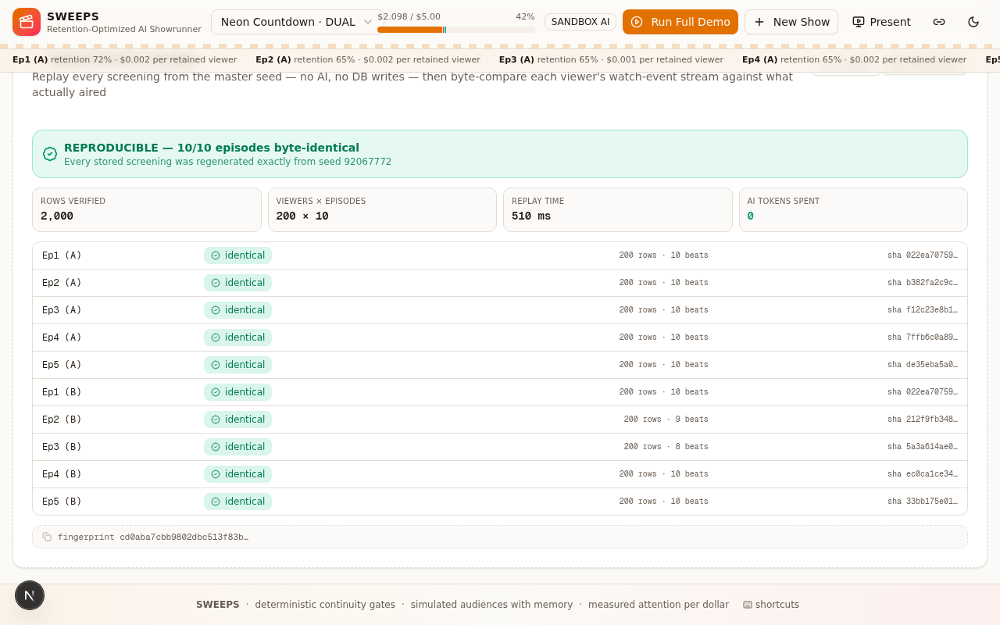
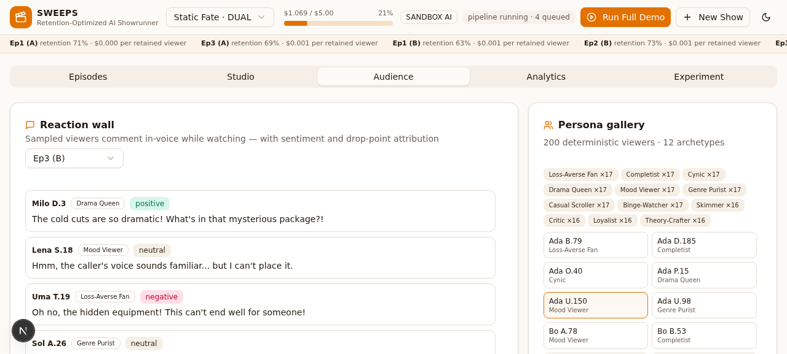

# SWEEPS — The Retention-Optimized AI Showrunner

> Every AI showrunner can generate an episode. **Sweeps knows if anyone would watch.**

Sweeps writes a serialized drama as a pipeline of typed "beats," deterministically validates every
script through a **Continuity Compiler before spending a single generation token**, renders it,
then screens it in front of a **simulated audience of persona viewers** with persistent, decaying
memory. A Thompson-sampling optimizer rewrites the next episode against **measured retention** —
and a dual-arm experiment (writer-only control vs audience-optimized treatment) proves the loop.

## The five claims (all measurable in the dashboard)

1. **The Gate.** 8 deterministic compile rules (C1-CAST, C2-PRESENCE, C3-TIMELINE, C4-PROP,
   C5-WARDROBE, C6-LORE, C7-BUDGET, C8-DURATION) reject unrenderable/contradictory scripts for
   **0 generation tokens**, with machine-actionable fixes. Try it: *Episodes → "Test the Gate"*.
2. **Reproducible retention curves.** The audience simulator is fully seeded (mulberry32) — the
   same show seed produces byte-identical curves across runs.
3. **Causal memory.** Viewers hold FSRS-inspired memories with retrievability
   `R = exp(−Δep / 0.9·stability)`. A previous episode's cliffhanger with `R > 0.5` adds +0.10
   satisfaction to the next episode's HOOK (see *Audience → Memory inspector*).
4. **The loop wins.** Arm B consumes cliffs + viewer quotes + Thompson-sampled beat variants;
   the verdict card shows retention lift (B − A) and cost-per-retained-viewer per arm.
5. **Budget receipts.** Every AI call is metered (per-token / per-image) into a cost ledger with
   per-stage caps (Writer 25% / Render 45% / Audience 20% / Optimizer 8%) and an automatic
   degradation ladder (video→stills, reaction sampling, subsample shrinking).

## Architecture

```
Writer Agent ──▶ Continuity Compiler ──▶ Render Crew ──▶ Simulated Audience ──▶ Optimizer
 (beat plans)     (pure TS, 0 tokens)     (stills/cards)   (200 seeded personas)    (Thompson)
      ▲                                                                    │
      └──────────── beat plan for episode N+1 ◀────────────────────────────┘
```

- **Next.js 16 App Router + TypeScript** · single route dashboard (5 tabs) · API routes only
- **Prisma + SQLite** — Show / Character / WorldEntity / Episode / Beat / Viewer / ViewerMemory /
  Screening / Experiment / CostEntry / JobLog
- **AI provider abstraction** — `AI_PROVIDER=sandbox` (z-ai-web-dev-sdk, zero keys) or
  `AI_PROVIDER=qwen` (DashScope OpenAI-compatible: qwen3.7-max / qwen-plus / qwen-vl-plus; Wan
  video slot ready). Identical JSON contracts; metering in both.
- **Pipeline state machine** — `WRITING → COMPILING ⟲(≤3) → RENDERING → SCREENING → ANALYZING →
  DONE`, every step persisted + JobLog'd, crash-safe, resumable, in-process queue.

## Run it

```bash
bun run db:push   # sync schema
bun run dev       # http://localhost:3000
```

Then: **Create the demo show** (or New Show with any premise) → **Run Full Demo**.
DUAL mode runs Ep1A, Ep1B, Ep2A, Ep2B, Ep3A, Ep3B automatically.

## Power features

- **Keyboard-driven studio.** `1–5` switch tabs, `A`/`B` select arm, `E` runs the next episode,
  `Shift+D` launches the full dual-arm demo, `T` toggles theme, `?` opens the shortcut cheat-sheet.
- **Portable episode artifacts.** Every finished episode exports as a **Markdown script** (beat plan,
  full dialogue, compile report, per-beat engagement) or **JSON** payload —
  `GET /api/episodes/:id/export?format=md|json`, or the Export button on the Episodes tab.
- **Analytics export.** Retention curves download as CSV with one click for external analysis.
- **Beat retention heatmap.** Episodes × beats matrix; the paired premiere renders as two identical
  rows — visual proof of the paired design — while arm-B rows stay visibly warmer late in episodes.
- **Audience exploration.** Search/filter the 200 persona viewers by name or archetype, open any
  viewer's arm-scoped memory inspector (FSRS-style R bars + watch history), and read the
  sentiment-tinted reaction wall with drop-point attribution.
- **Stage-aware budget bar.** The header budget meter is segmented by pipeline stage
  (render/writer/audience/optimizer), so governance caps are visible at a glance.

## Experimental design (why the demo is trustworthy)

- **Paired premiere.** In DUAL mode, Episode 1 is generated once and *reused verbatim* in both
  arms, so both universes start from the identical episode. The ep1→ep3 retention delta therefore
  measures the optimizer loop — not LLM premiere luck.
- **Parallel-timeline memory.** Viewer memories are arm-scoped (`ViewerMemory.arm`): the same 200
  personas watch both timelines, each with its own memory continuity. The paired premiere screens
  against a pristine memory state in both arms.
- **Seeded determinism.** `Math.random` is banned in simulation paths; every viewer, screening,
  trope-fatigue factor and reaction derives from `mulberry32` chains rooted in `show.seed`.
  Re-screening the same episode replays byte-identical curves (verified).
- **Honest failure modes.** `COMPILE_FAILED` = the gate rejected the script (report rendered,
  tokens saved shown — a feature). `PIPELINE_ERROR` = infra crash (resumable from the last
  persisted artifact, never masquerading as a creative failure).

## Measured numbers (from the last full run)

Final verified run — "Neon Countdown" (seed 92067772, panel 200, 3 episodes × 2 arms, paired
premiere, budget $5.00, total spend $1.35):

| Metric | Arm A — control | Arm B — full loop |
|---|---|---|
| Ep1 (paired premiere) | 71.5% | 71.5% (identical by design) |
| Ep2 | 65.0% | **70.0%** |
| Ep3 | 65.0% | **69.5%** |
| Retention Δ EP1→EP3 | −6.5 pts | **−2.0 pts** |
| **Lift (B − A)** | | **+4.5 pts** |
| Cliffs / episode (avg) | 7.0 | **5.7** (EP3: 8 vs 4) |
| Avg spend / episode | $0.227 | **$0.214** |
| Cost per retained viewer | $0.0016 | **$0.0015** (−6%) |

- Compile gate: fixture (`fixtures/bad-beat.json`) fails C2-PRESENCE + C4-PROP with 2 ERRORs and
  1 WARN — **$0.00 generation spend** (vs ~$0.72 estimated render cost saved); production plans
  auto-repair in bounded deterministic passes ($0) + ≤1 LLM repair.
- Panel: 200 viewers × 6 episodes; same-seed re-screen replays byte-identical curves (verified).
- Stage ledger: RENDER $1.32 · WRITER $0.018 · OPTIMIZER $0.004 · AUDIENCE $0.001.
- Full receipts: **Experiment tab** / `GET /api/shows/:id/experiments` (per-arm deltas, lift,
  Thompson evidence with n=40 micro-screening, viewer quotes).





## Environment flags

| Flag | Default | Meaning |
|---|---|---|
| `AI_PROVIDER` | `sandbox` | `sandbox` (z-ai-web-dev-sdk) or `qwen` (DashScope) |
| `QWEN_BASE_URL` / `DASHSCOPE_API_KEY` | — | Qwen production path |
| `RENDER_IMAGE_BEATS` | `HOOK,REVEAL,TWIST,CLIFFHANGER` | which beat types get AI stills |
| `CONSISTENCY_GATE` | `on` | VLM consistency check on REVEAL/TWIST stills |

## Hackathon mapping

- **Track 2 — AI Showrunner**: full pipeline (script → storyboard → render → episode), token-budget
  aware, continuity-gated.
- **Cross-track 1 — MemoryAgent**: per-viewer FSRS memory drives measurable satisfaction.
- **Cross-track 3 — Agent Society**: 200 persona agents + writer + optimizer form a measured
  creative society; single-agent (control arm) baseline included by design.
